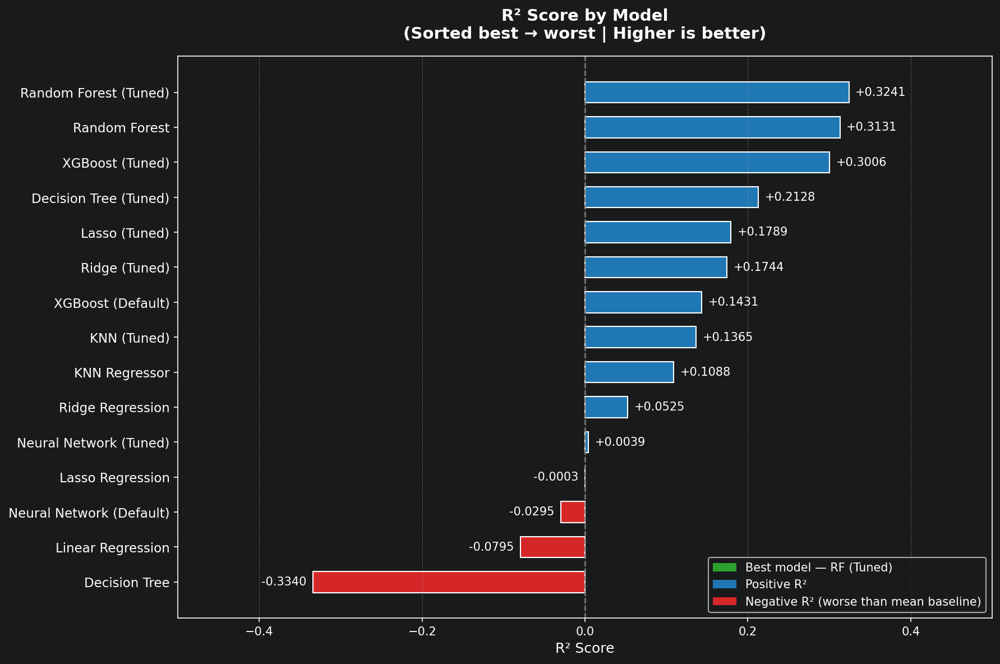
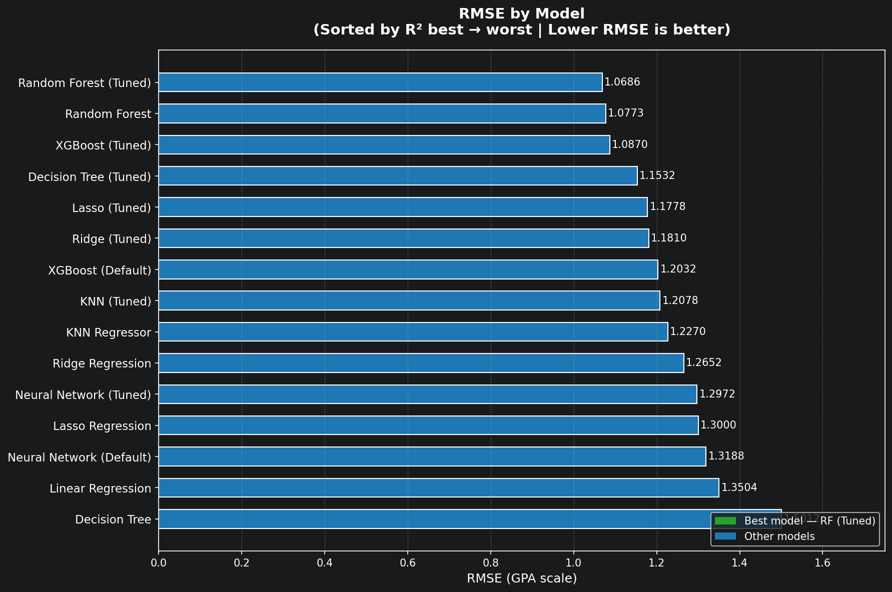
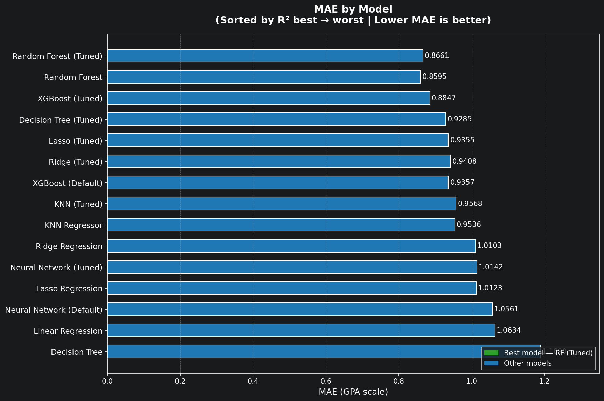
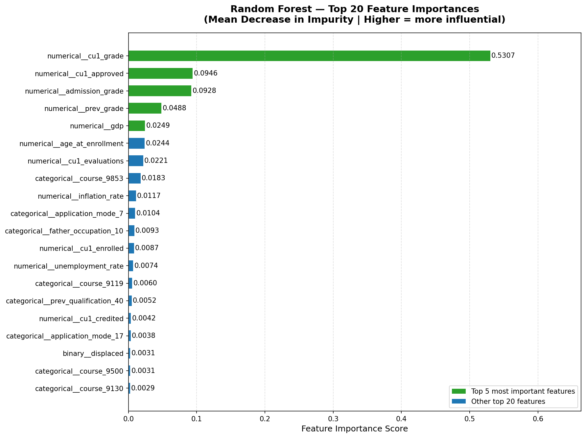

# Students Outcome Predictor

**Author:** Wesly Laboy

---

## Executive summary
This project is about building a system to find students who might `Dropout` and understand why they are struggling academically. 
Applying EDA to data from 4,424 students, I saw that how many classes they pass (academic momentum) and if they have money problems 
(tuition status and scholarships) are the biggest signs of success. The EDA showed that students who don't pass any classes 
in their first year or owe tuition money are at very high risk. I want to use these findings to help advisors reach out 
to students early, before they decide to `Dropout`.

---

## Why should anyone care about this question?

Most universities only notice a student is in trouble when it’s too late, after they already failed a class or stopped showing up. 
This is bad for the student and the school. If we can spot the "red flags" early, like a sudden drop in grades or missing a payment, 
the university can help the student fix the problem before it gets too big to handle.

---

## Rationale

This project uses machine learning to answer two questions that academic advisors face every day:

1. Which currently enrolled students are most likely to drop out, and how can we identify them early enough to intervene?  
2. For students flagged as dropout risk, which factors are causing their low academic performance, and where should advisors focus their support to give those students the best chance of succeeding?

---

## Data Source

The dataset is available at the UC Irvine Machine Learning Repository:  
[https://archive.ics.uci.edu/dataset/697/predict+students+dropout+and+academic+success](https://archive.ics.uci.edu/dataset/697/predict+students+dropout+and+academic+success)

---

## Outline of project

- [Data Cleaning Notebook](./notebooks/01_data_cleaning.ipynb): Data cleaning process and preparation of the data.
- [EDA Notebook](./notebooks/02_exploratory_data_analysis.ipynb): The charts, insights, and our first basic model.
- [Classification Model](notebooks/03_classification_model.ipynb): The baseline model and its evaluation.
- [Regression Model](./notebooks/04_regression_model.ipynb): GPA prediction and feature importance for students at risk.
- [Final Dataset](./data/processed/02.7_data_final.csv): The clean dataset we used for our analysis.

---

#### Methodology
1. **Cleaning the Data:** I checked for missing info and fixed some columns. For example, I made a special "flag" for students who didn't provide certain info, as this can sometimes be a sign of risk.
2. **Looking for Patterns (EDA):** I made charts to see how things like age, debt, and grades affect whether a student stays or leaves.
3. **Creating New Features:** I combined some data to get better insights, like:
   - `total_approved_units`: Adding up all classes passed in the first year.
   - `grade_progression`: Checking if grades went up or down between semesters.
   - `age_group`: Grouping students by age to see which groups struggle the most.
4. **Baseline Model:** I started with a simple model (Logistic Regression) to get a basic idea of how well we can predict dropouts. I focused on "Recall," which means we want to make sure I don't miss any students who actually need help.
5. **Classification Model:** After the baseline, I trained and compared 23 model
configurations across 7 algorithms: Logistic Regression, Decision Tree, KNN, SVM,
Random Forest, XGBoost, and a Neural Network. I also handled the imbalance between
dropout and graduate students using `class_weight='balanced'` and SMOTE. The best
model was XGBoost with a custom threshold of 0.40, which caught 86% of all actual
dropout students. I then used this model on the 794 enrolled students and flagged
391 of them as being at risk.
6. **Regression Model:** For the students flagged as at risk, I built a second model
to predict their second semester GPA and understand what is causing their low
performance. I trained and compared models using Linear Regression, Ridge, Lasso,
Random Forest, and XGBoost. The best model was a Tuned Random Forest with an RMSE
of 1.07, meaning predictions were off by about 1 grade point on average. The most
important output was the feature importance analysis, which showed that first
semester grades were the strongest signal, followed by financial stress indicators
like tuition debt and scholarship status.
---

## Algorithms

- Logistic Regression (baseline)
- Decision Tree
- Random Forest
- K-Nearest Neighbors (KNN)
- Support Vector Machines (SVM)
- XGBoost
- Neural Network (MLP)

---

## Results

***From EDA:***
*   **Passing Classes is key:** This is the biggest sign. Graduates usually pass **10–12 classes** in their first year, while most dropouts pass **0 classes**.
*   **Money is important:** Students who owe tuition or have debt drop out much more often. On the other hand, **76% of students with scholarships graduate**, compared to only 41% of those without one.
*   **The Age Factor:** The dropout rate peaks for students between 26 and 30 years old.
*   **Missing Info:** If a student has missing administrative info, they are twice as likely to drop out. It might mean they aren't very "connected" to the school.

***From Baseline Model (Logistic Regression):***
The baseline model achieved an overall **Accuracy of 88%**, establishing a strong starting point for predictions.
*   **Recall (Dropout): 0.82** – The model successfully caught 82% of all actual dropouts.
*   **Precision (Dropout): 0.86** – When the model flags a student at risk, it is right 86% of the time.
*   **Confusion Matrix Analysis:** The model correctly identified **234 True Positives** (dropouts caught) while missing 50 students (False Negatives). Reducing the False Negatives is the primary goal for future, more advanced models.
*   **Technical Finding:** Using `class_weight='balanced'` was critical to account for the smaller number of dropout entries, ensuring the model take into consideration class imbalance.

---

## Classification Model Report

### The Problem I Was Trying to Solve

Universities have a hard time knowing which students are going to dropout. By the time a student stops showing up, it is usually too late to help them. In the first part of this project, I tried to answer one question: **can we look at a student's information right now and tell if they are likely to leave before finishing?**

The model was used on students who were already enrolled and had not yet graduated or dropped out, 794 students in total. The model was trained on students whose outcomes we already know (Graduate or Dropout), and then we used it to make predictions for the enrolled group.

### How I Built the Model

I trained 23 different versions of models, using 7 different methods:

| Algorithm | Configurations Tested |
|---|---|
| Logistic Regression | Baseline, Tuned, with custom threshold |
| Decision Tree | Baseline, Tuned, with SMOTE |
| K-Nearest Neighbors | Tuned, with SMOTE |
| Support Vector Machine | Baseline, Tuned, with SMOTE |
| Random Forest | Baseline, Tuned (GridSearch), Tuned (RandomizedSearch), with SMOTE |
| XGBoost | Baseline, with SMOTE, with RandomizedSearch |
| Neural Network | Baseline, Tuned |

For each model, I measured how many at risk students it correctly caught. This is called **Recall for the Dropout class**, the main metric I used to compare models.

I chose Recall as the priority because **missing a student who is going to drop out is worse than flagging a student who is actually going to graduate**. It is better to offer help to someone who does not need it than to ignore someone who does.

---

### Why I Used a Custom Threshold

By default, most models say "Dropout" only when they are more than 50% sure. I changed this so that the model flags a student as at risk when it is more than 40% sure. This makes the model more careful, and it catches more students who need help, even if it also flags a few extra students who would have graduated anyway.

---

### The Model I Picked

After comparing all 23 versions, I chose the **XGBoost Baseline model with a threshold of 0.40**.

Here is how it performed on the test group (726 students the model had never seen before):

| Result | Number of Students |
|---|---|
| Correctly identified Dropout students | 245 out of 284 |
| Dropout students missed | 39 |
| Graduate students flagged incorrectly | 21 |
| Correctly identified Graduate students | 421 out of 442 |

This model found the most at risk students while having the fewest false alarms. It had a **Dropout Recall of 0.86** and an overall accuracy of **90%**.

---

### What the Model Learned

After training, I looked at which pieces of information had the biggest effect on predictions. The results fell into four clear groups:

**Academic Performance (36% of total influence)**
- The single most important signal is how many courses a student passed in their second semester (`cu2_approved`). This one feature alone accounted for 27% of the model's decisions.
- Total courses approved across both semesters (`total_approved_units`) was also very important.
- Students who are falling behind in class are the easiest to identify as at-risk.

**Course / Program Type (30% of total influence)**
- Several specific programs appeared repeatedly in the top features.
- This means dropout risk is different across all departments. Some programs have noticeably higher risk patterns than others.
- This is useful for institutions, it shows where to focus program level support.

**Financial Situation (15% of total influence)**
- Whether a student has their tuition paid up to date (`tuition_fees_up_to_date`) was the second most important single feature.
- Scholarship status and whether a student has debt also showed up clearly.
- Financial stress is a real and measurable warning sign.

**Demographics (3% of total influence)**
- Age at enrollment had a small but measurable effect.
- Overall, what a student does, how many courses they pass, whether they pay tuition is more predictive than who they are.

---
### What I Found When I Applied the Model to Enrolled Students

I loaded the saved model and ran it on all 794 currently enrolled students. These students were never seen during training, the model had no idea about their outcomes when it was trained.

The results:

| Prediction | Number of Students | Percentage |
|---|---|---|
| Likely Graduate | 403 | 50.8% |
| Dropout Risk | 391 | 49.2% |

**391 students were flagged as Dropout Risk.**

This is a high number, but it makes sense for two reasons:
1. The threshold is set at 0.40, which makes the model more aggressive in catching students at risk.
2. Many enrolled students may show early warning signs, low course approvals, overdue tuition, that look similar to patterns seen in students who eventually dropped out.

This list of 391 students is **not a verdict**. It is a starting point for advisors to begin conversations to check in, ask questions, and offer support before it is too late.

---

### What Institutions Can Do With This

Based on the model results, we suggest the following actions:

- **Reach out early** — Contact the 391 flagged students before they fall behind further. A simple checkin conversation can make a difference.
- **Focus academic support** — Prioritize students with low second semester course approvals. This is the strongest signal the model found.
- **Focus financial support** — Look at students with overdue tuition or no scholarship. Financial stress is a clear and manageable risk factor.
- **Look at high-risk programs** — Certain programs appeared repeatedly in the feature importance results. Advisors in those departments should be especially proactive.
- **Use the model regularly** — Running this prediction at the start of each semester allows institutions to catch new at risk students before problems get worse.

---

## Regression Model Report

### The Problem I Was Trying to Solve

After the classification model identifies which students are at risk of dropping out, the next question is: **what is causing their low performance?** Just knowing that a student is at risk is not enough. Advisors need to know where to focus their help.

For this reason I built a regression model that tries to predict the second semester GPA (`cu2_grade`) for students that were already flagged as dropout risk by the classification model. The GPA prediction itself is useful, but the most important output is the feature importance analysis, which tells us which factors are most connected to low performance for each student.

This regression model was trained and applied only on the 1,011 students the classification model flagged as being at risk.

---

### How I Built the Model

I tested 7 different regression methods in total, starting from simple models and going to more complex ones:

| Algorithm | Configurations Tested |
|---|---|
| Linear Regression | Baseline |
| Ridge Regression | Baseline, Tuned with GridSearchCV |
| Lasso Regression | Baseline, Tuned with GridSearchCV |
| K-Nearest Neighbors | Baseline, Tuned with GridSearchCV |
| Decision Tree | Baseline, Tuned with GridSearchCV |
| Random Forest | Baseline, Tuned with RandomizedSearchCV |
| XGBoost | Baseline, Tuned with RandomizedSearchCV |
| Neural Network (MLP) | Baseline, Tuned with RandomizedSearchCV |

For evaluation I used three metrics: **RMSE** (how big the prediction errors are on average), **MAE** (average absolute error in GPA points), and **R2** (how much GPA variation the model can explain).

---

### The Model I Picked

The best model was the **Tuned Random Forest Regressor**. Here are the results on the test set:

| Metric | Value | What it means |
|---|---|---|
| R2 | 0.3241 | The model explains about 32% of GPA variation |
| RMSE | 1.0686 | Predictions are off by about 1.07 GPA points on average |
| MAE | 0.8661 | The typical prediction error is about 0.87 GPA points |

The R2 of 0.32 is not a high number by general standards, but it is expected here. The model was trained only on students already flagged as dropout risk. This is a much more similar group of students than the general population. When everyone in the group is already struggling in similar ways, there is less variation to explain. The model is not failing. It is working on a harder and more specific problem.

---

### How All Models Compared

The three charts below show how every model performed across R2, RMSE, and MAE.

**R2 Score by Model**

The tuned Random Forest had the highest R2 at 0.3241. Some models like the default Linear Regression and the default Decision Tree had negative R2, which means they performed worse than just predicting the average GPA for every student.

**RMSE by Model**

The tuned Random Forest had the lowest RMSE at 1.0686. The untuned Decision Tree had the worst RMSE at 1.50, showing it was memorizing the training data and not generalizing well.

**MAE by Model**

Random Forest models dominated here as well. All tuned models improved over their default versions, confirming that hyperparameter tuning was necessary for all algorithms in this task.

---

### What the Model Learned

After selecting the best model, I looked at which features had the most influence on GPA predictions for students at risk.

The results are very clear. One feature stands out above all others:

**First Semester Grade (`cu1_grade`) accounts for more than 53% of the model predictive power.** How well a student performed in semester one is by far the strongest signal for their semester two GPA. This makes a lot of sense because a student who is already struggling in their first semester will very likely continue to struggle in the next one.

The other top features were:

**Academic performance (biggest group of influence)**
- `cu1_approved` (number of courses passed in semester 1) was the second most important feature. Students who pass more units early tend to have higher GPAs.
- `admission_grade` (grade at admission) was the third most important. Prior academic achievement predicts future performance, which is a known pattern in education research.

**Financial situation**
- Students with active debt (`debtor = 1`) tend to score lower. Financial pressure affects academic focus.
- Students with tuition up to date tend to perform better. Financial stability and academic performance are connected.

**Economic environment**
- GDP, inflation rate, and unemployment rate appeared in the model but had very weak influence. The macroeconomic environment adds almost nothing once personal and academic factors are already included.

---

### What Institutions Can Do With This

The regression model gives advisors a second layer of information after the classification model already flagged who is at risk. Based on the results we suggest the following:

**Act before semester two starts**
The first semester grade is the strongest predictor of second semester GPA. By the time a student finishes semester one with a low grade or very few approved units, the signal is already there. Advisors should not wait for semester two grades to come in. A conversation at the end of semester one or at the very beginning of semester two gives more time to help.

**Treat financial problems separately from academic problems**
A student flagged as dropout risk who also has `debtor = 1` or unpaid tuition is dealing with two problems at the same time. Financial stress affects grades directly, not just dropout risk. These students should be connected with financial aid, payment plans, or emergency funding options before academic help can make a real difference. Trying to fix the academic problem without dealing with the financial one first is unlikely to work.

**Use the feature importance as a starting point for conversations**
The goal of this model is not to give an exact GPA number. It is to tell the advisor where to start. If a student's low predicted GPA is mostly explained by `cu1_grade` and `cu1_approved`, the conversation should be about academic support. If the student also has `debtor = 1`, financial help should come first.

---

## Next Steps

This project answered two questions: which students are at risk of dropping out, and what is causing their low performance. The models work and produce useful results, but there is more that could be done to make them more reliable and more useful in practice.

**Retrain the models each semester**
The models were trained on historical data. Student behavior, financial conditions, and program structures change over time. Running the models on fresh data each semester would keep the predictions relevant and catch patterns that might shift year to year.

**Add attendance and engagement data**
The current dataset does not include attendance records, library usage, or learning management system activity. These are strong early warning signals that many institutions already collect. Adding them would likely improve the classification model recall and give the regression model more to work with when predicting GPA.

**Improve the regression model**
The best regression model explained about 32% of GPA variation, which is useful but limited. Some of that limitation comes from the data itself: when the input group is already a narrow set of struggling students, there is less variation to explain. Getting access to more granular academic records, like grades per subject rather than just the overall semester grade, could help the model find more useful patterns.

**Build a simple interface for advisors**
Right now the model output is a list of student IDs with dropout probabilities and feature importances. A simple dashboard or report that an advisor can open without knowing Python would make it much easier to use in practice. The classification and regression outputs could be combined into one view per student: dropout risk level, predicted GPA, and the top two or three factors driving that prediction.

**Test the model in a live setting**
The final step would be to work with an institution to actually use the flagged student list during a real semester and measure whether the interventions made a difference. The model tells you who to help and where to start, but the real test is whether that information leads to fewer students dropping out.

---

##### Contact and Further Information
If you have any questions about this work, feel free to reach out to Wesly Laboy.
